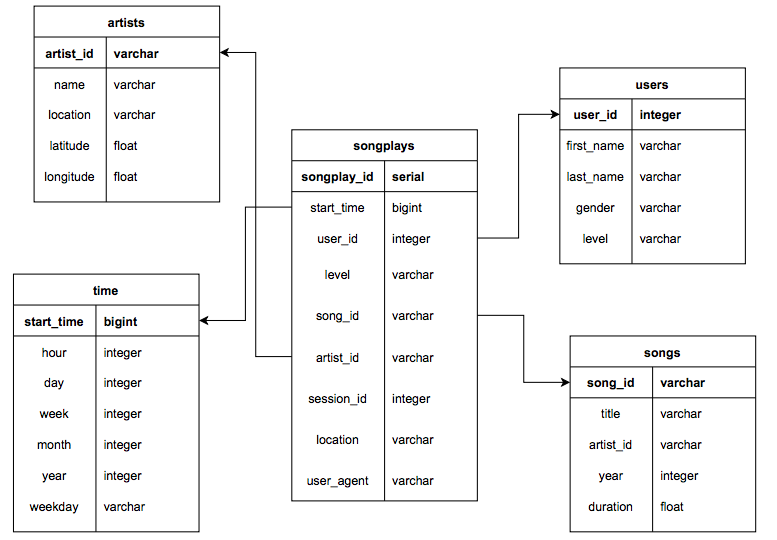

# Data Modeling with Postgres

## Objective

---

Create a database of Sparkify's users activity from multiple sources by implementing a ETL pipeline to enable the query of data.

## Implementation

---

### Design

The database have a star schema that simplifies queries and is used commonly for online analytics processing. The tables are as follows:

- Fact Table
    - `songplays`: Logs of songs plays 
    
- Dimension Tables
    - `users`: Contains users attributes
    - `songs`: Contains songs attributes
    - `artists`: Contains artists attributes
    - `time`: Contains time attributes

The schema can be visualize as follows:


### ETL pipeline

We have two sources: 
- Songs Dataset: [Million Song Dataset](http://millionsongdataset.com/).
- Logs Dataset: Activity logs of users using the Sparkify app.

Given that the *logs dataset* only have metadata about user's activity we must extract the information about songs from the *songs dataset*. The names of the songs provided on the *logs dataset* are used to create the *songs* and *artists* tables extracting the relevant information from the *songs dataset*. The attributes of users are stored in the *users* table. Finally, attributes regarding the time of logs are created and stored in the *time* table.

### Files

- `create_tables.py`: contains functions to drop/create database and drop/create tables

- `sql_queries.py`: contains SQL queries used in ETL.

- `etl.py`: contains functions to process from datasets and load data to database

- `test.ipynb`: iPython notebook that can be used to test queries to database

## Instructions

---

1. Run `create_tables.py` to create database and tables

2. Run `etl.py` to extract, transform and load data into tables

3. You can make queries from `test.ipynb`

## Query Examples

---

> Number of plays per location

```
SELECT location, COUNT(*) FROM songplays GROUP BY location;
```

> Number of plays per level of user

```
SELECT level, COUNT(*) FROM songplays GROUP BY level;
```